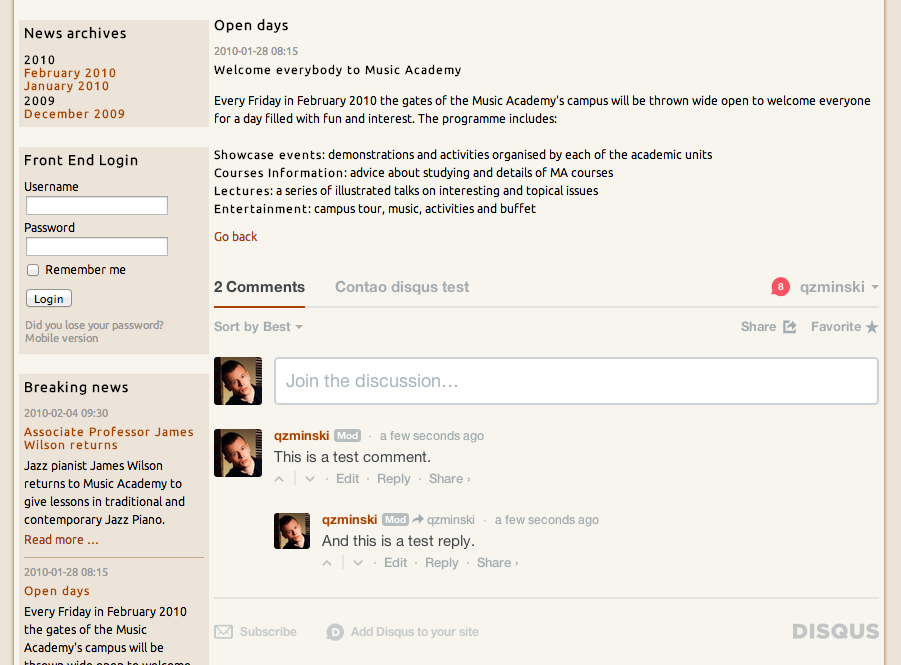

# Disqus extension for Contao Open Source CMS

Disqus is an extension for the [Contao Open Source CMS](https://contao.org).

Use the Disqus comment system on your Contao website. You can use it as front end module or content element. 
All you need to launch is the "shortname" identifier of the comments thread - it is an autogenerated value 
in the Disqus administrator panel.

For more information about the Disqus system please visit: [https://disqus.com](https://disqus.com).

## Documentation

[Read the documentation](docs/README.md)

## Copyright

This project has been created and is maintained by [Codefog](https://codefog.pl).
