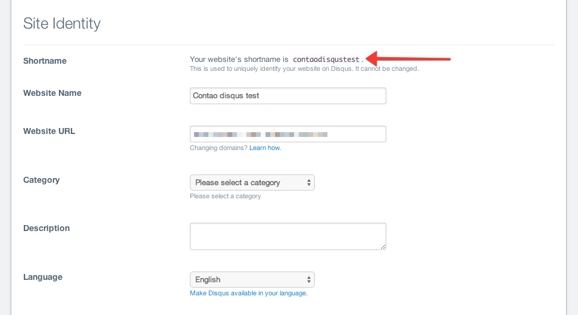

# Disqus – Documentation

## Configuration

First of all, you need to configure your site in the Disqus administration panel. Once you are logged in and created 
a new site, please go to its `Settings` tab. Find a section `Side Identity` and copy your unique shortname.

Then, create a new front end module and enter the unique Disqus shortname in its settings. 
The last step is to put your module on the website - it can be greatly used with news or events!

You can optionally enter the `Disqus identifier` which allows to load the same thread of comments on other pages. 
See the [official documentation](https://help.disqus.com/customer/portal/articles/472099-what-is-a-disqus-identifier-) for detailed description.



## Template shortcode

You can also initialize the comment system anywhere in your system (e.g. template files) by using the code below:

```php	
<?php echo Disqus::generateComments('my_shortname'); ?>
```